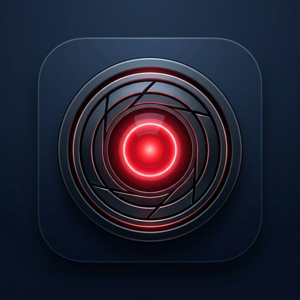

# 🛡️ EdgeVision: Smart Offline Security for Local Shops

**Empowering small businesses with affordable, internet-independent AI security.**

## 🌍 The Mission
In many regions, particularly across Nigeria and emerging markets, small shop owners (kiosks, warehouses, retail stores) face a dual challenge: security risks and high data costs. **EdgeVision** solves this by providing a professional-grade security monitor that runs **100% offline** on any standard Android device.

## 🚀 Key Features
- **Intelligent Person Detection**: Powered by a highly-optimized YOLOv8-nano model.
- **Visitor Analytics**: Automatically counts and logs visitors throughout the day.
- **Instant Alerts**: High-visibility visual cues and audio beeps (Web Audio API) the moment a person is detected.
- **Data-Zero Architecture**: No internet connection required after initial setup.
- **Ultra-Lightweight**: The entire AI "brain" is shrunken to just **3.4MB** using INT8 Level Quantization.

## 🛠️ Technical Sophistication
This project demonstrates advanced expertise in **Edge AI** and **Mobile Optimization**:
- **Model Compression**: Quantized a 12MB YOLOv8 model down to **3.4MB (INT8)** to ensure high SPF (Screens Per Second) on low-spec mobile CPUs.
- **PWA to APK Pipeline**: Developed as a Progressive Web App with a robust **Service Worker (`sw.js`)** for permanent offline caching.
- **Cross-Platform**: Includes both a mobile-ready PWA/APK and a desktop Python monitor (`app.py`).
- **Low Latency**: Optimized inference loop using **TensorFlow.js TFLite** for real-time performance.

## 📱 Getting Started (APK)
1.  **Visit the Live Demo**: [https://mfoniso1.github.io/edgevision/mobile-app/](https://mfoniso1.github.io/edgevision/mobile-app/)
2.  **Install on Android**: Open in Chrome, select "Install App" or "Add to Home Screen".
3.  **Go Offline**: Once the AI brain loads (approx. 5 seconds), you can turn off Data/Hotspot. The security system will remain 100% active.

## 📈 Impact & Vision
EdgeVision is more than just a tool; it's a scalable security framework for the "Next Billion Users."
- **Fellowships & Partnerships**: I am looking for fellowships and research opportunities in **Embedded AI** and **Social Impact Tech**.
- **Funding & Expansion**: Seeking funding to integrate IoT hardware support (ESP32-CAM) and multilingual audio alerts (Yoruba, Igbo, Hausa).

## 🧑‍💻 Author
**Mfoniso**  
[GitHub](https://github.com/Mfoniso1) | [LinkedIn](#) | [Email](#)

---
*Developed with a focus on high-performance, low-power AI for a safer, more connected world.*
